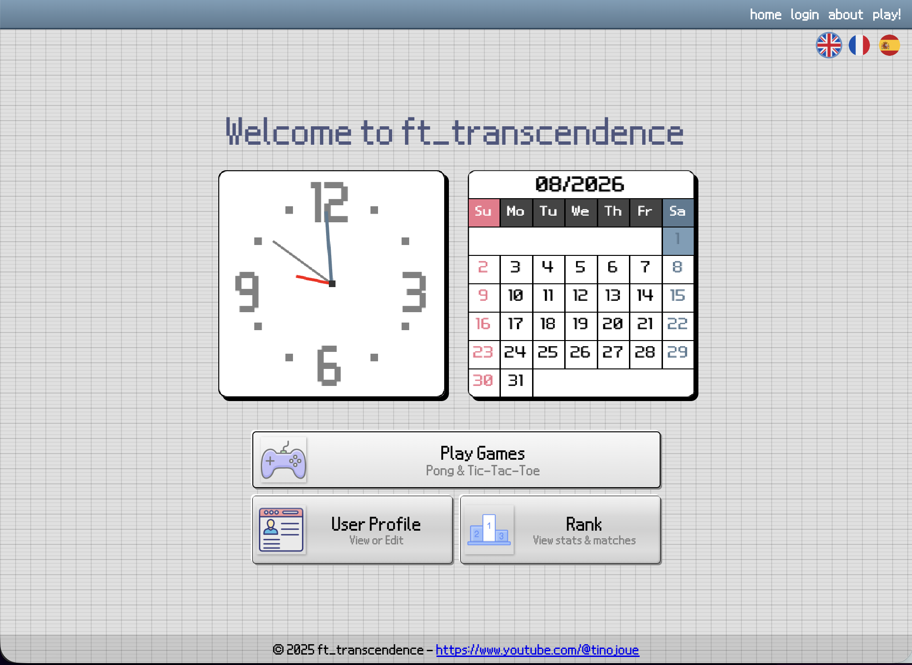
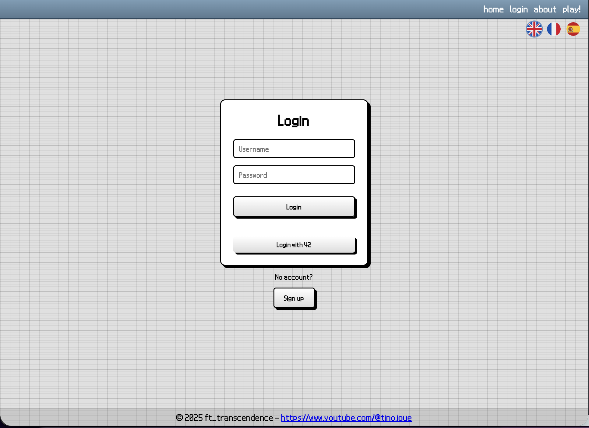
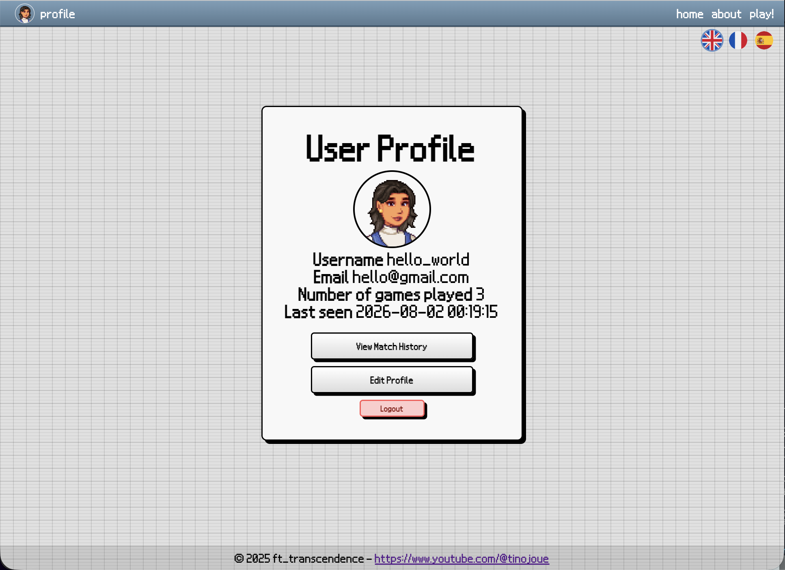
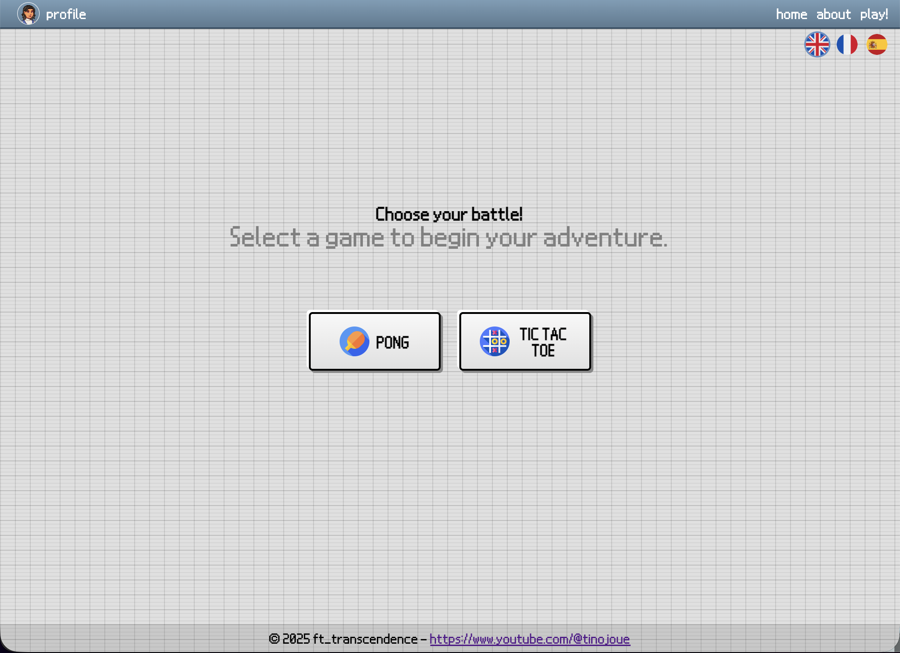
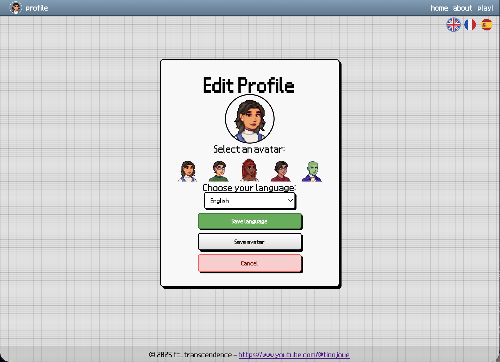

# ft_transcendence

ft_transcendence is a 42 School project: a real-time web gaming platform (Pong & Tic-Tac-Toe) with user accounts, tournaments, live chat, a leaderboard, and two-factor authentication.

The UI design is inspired by the Nintendo DS: pixel-art avatars, a bottom-screen "console" home page with a clock and calendar widget, and a chunky retro button style throughout.

## Screenshots

| Home | Login | Profile |
|------|-------|---------|
|  |  |  |

| Game selection | Edit profile |
|-----------------|--------------|
|  |  |

## Tech stack

| Component  | Technology |
|------------|-------------|
| Backend    | Django REST Framework + Django Channels (WebSockets), Gunicorn/Daphne |
| Frontend   | Vanilla JavaScript (custom SPA, routing via `#/...`), HTML/CSS |
| Database   | PostgreSQL |
| Cache / Pub-Sub | Redis (Channels layer) |
| Reverse proxy | Nginx (TLS, serves the static frontend + proxies `/api` and `/ws`) |
| Containerization | Docker / Docker Compose |

## Features

- Authentication: classic register/login, JWT (`simplejwt`), OAuth via the 42 API, two-factor authentication (2FA) with `pyotp`
- Games: Pong (solo, multiplayer, AI, tournament) and Tic-Tac-Toe (with AI and tournament)
- Tournaments: creation, joining, leaving, match history
- Live chat over WebSockets (Django Channels + Redis)
- User profiles: customizable avatar, leaderboard, rank
- Internationalization: FR / EN / ES (`frontend/assets/lang.json`)

## Project structure

```
.
├── backend/            # Django application (REST API + WebSockets)
│   ├── config/         # Main app (models, views, serializers, routing...)
│   ├── fixtures/       # Initial data
│   └── locale/         # Django translation files
├── frontend/           # Vanilla JS SPA
│   ├── assets/         # Avatars, icons, fonts, translations
│   ├── scripts/        # JS logic (routes, games, chat, profile...)
│   └── styles/         # Stylesheets
├── dockers/            # Dockerfiles & configs (django, postgres, nginx)
├── scripts/            # Utility scripts (build.sh, clean.sh)
└── docker-compose.yml
```

## Prerequisites

- Docker & Docker Compose
- On macOS: [Colima](https://github.com/abiosoft/colima) (used by `scripts/build.sh`)

## Setup & run

1. Copy the environment file and edit it as needed:

   ```bash
   cp .env.example dockers/.env.dev
   ```

2. Run the build script (starts Docker/Colima, builds the images, applies migrations, loads fixtures, and compiles translations):

   ```bash
   ./scripts/build.sh
   ```

3. The app is then available at `https://localhost:8443` (or the port set by `NGINX_PORT`).

### Cleanup

```bash
./scripts/clean.sh
```

Stops and removes containers, volumes, networks, the Docker build cache, and generated log files.

## Environment variables

See [.env.example](.env.example) for the full list (domain name, ports, Django secrets, PostgreSQL credentials...). The actual file used by Docker is `dockers/.env.dev` (not versioned).

## Docker services

| Service    | Role | Exposed port |
|------------|------|-------------|
| `nginx`    | TLS reverse proxy, serves the frontend and routes `/api` and `/ws` | 8443 |
| `backend`  | Django API (Gunicorn) | 4000 |
| `postgres` | Database | internal |
| `redis`    | Channel layer for chat/WebSockets | internal |
